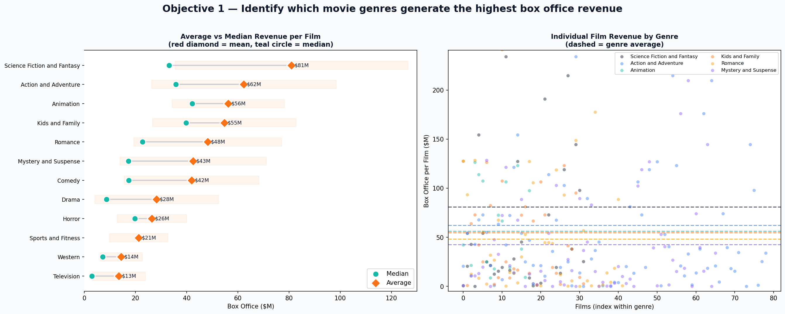
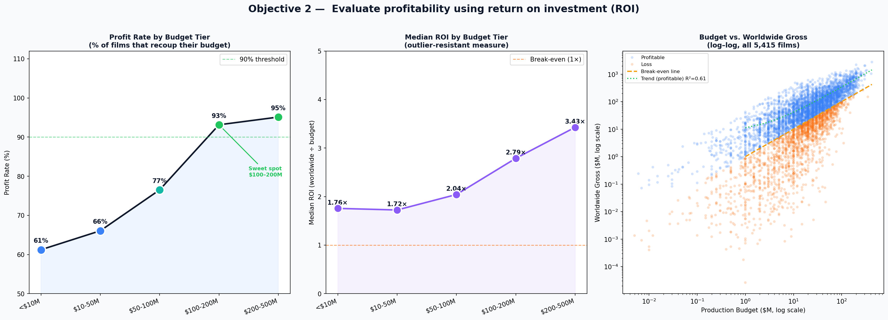
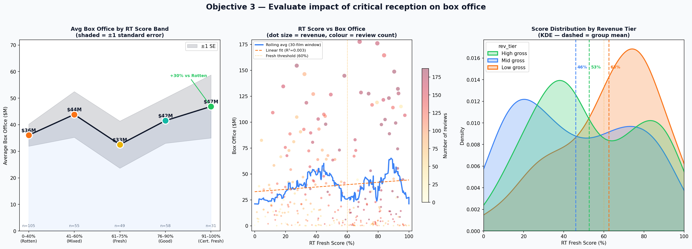
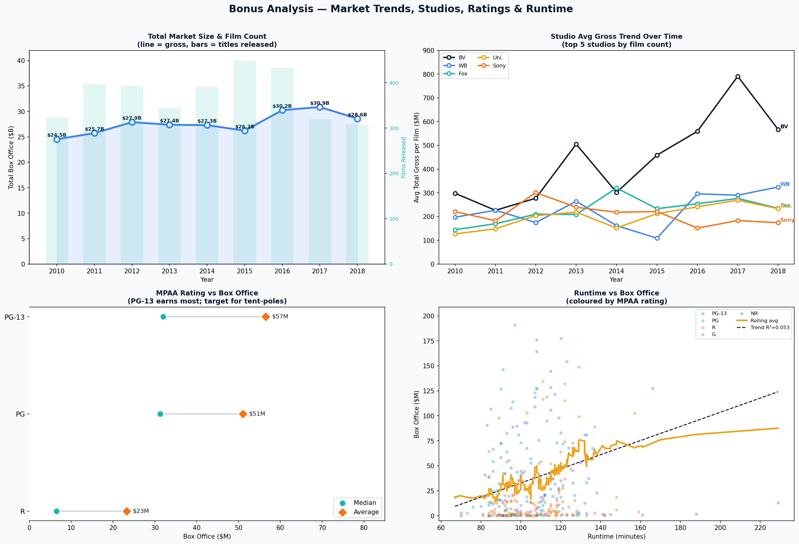
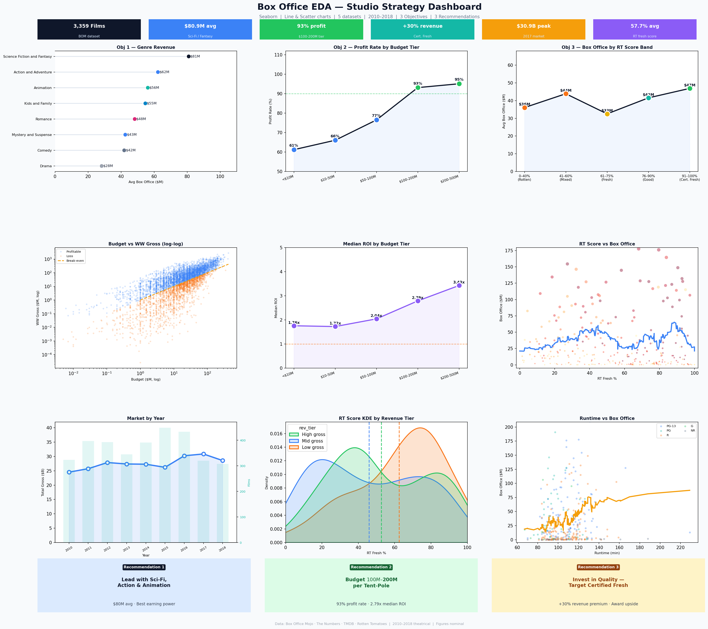

# 🎬 Box Office Intelligence: EDA for a New Movie Studio

### Exploratory Data Analysis Report — New Movie Studio Initiative

---

## Table of Contents

1. [Business Understanding](#1-business-understanding)
2. [Data Understanding](#2-data-understanding)
3. [Data Preparation](#3-data-preparation)
4. [Modeling and Evaluation](#4-modeling-and-evaluation)
   - [Objective 1 — Genre Revenue](#objective-1--identify-which-movie-genres-generate-the-highest-box-office-revenue)
   - [Objective 2 — ROI by Budget Tier](#objective-2--evaluate-profitability-using-return-on-investment-roi)
   - [Objective 3 — Critical Reception](#objective-3--evaluate-impact-of-critical-reception-on-box-office)
5. [Bonus Analysis](#5-bonus-analysis--market-trends-studios-ratings--runtime)
6. [Deployment — Strategy Dashboard](#6-deployment--strategy-dashboard)
7. [Strategic Recommendations](#7-strategic-recommendations)
8. [Chart Type Selection Guide](#8-chart-type-selection-guide)
9. [Final Summary](#9-final-summary)
10. [Data Sources & Limitations](#10-data-sources--limitations)
11. [Contributors](#11-contributors)

---

## 1. Business Understanding

### 1.1 Overview

The company plans to enter the film industry by launching a new movie studio. However, it currently lacks experience in film production and does not have a clear strategy for selecting the types of movies to produce. Given the high costs and risks associated with movie production, it is critical to make data-driven decisions to increase the likelihood of box office success.

### 1.2 Problem Statement

The company does not know which types of films are most successful at the box office or which characteristics (e.g., genre, budget, release timing) contribute to higher profitability. Without this knowledge, the studio risks investing in films that may not generate sufficient returns.

### 1.3 Objective

The objective of this analysis is to explore historical movie data to identify the key drivers of box office performance. This includes analyzing how genre, budget, and other film attributes influence revenue, return on investment (ROI), and profitability. The goal is to translate these insights into a practical strategy that the studio can use to guide its film production decisions.

Specifically, the analysis aims to:

- Identify which movie genres generate the highest box office revenue
- Evaluate profitability using return on investment (ROI)
- Evaluate the impact of critical reception on box office performance
- Analyze the relationship between production budget and revenue
- Distinguish between consistently profitable and high-risk film types
- Provide a data-driven strategy to guide film production decisions

### 1.4 Success Metrics

| Metric                         | Description                                                               |
| ------------------------------ | ------------------------------------------------------------------------- |
| **Worldwide Gross Revenue**    | Measures total box office performance                                     |
| **Production Budget**          | Represents the cost of producing a film                                   |
| **Profit**                     | Calculated as worldwide gross minus production budget                     |
| **Return on Investment (ROI)** | Measures efficiency of investment (`worldwide_gross / production_budget`) |
| **Profitability Rate**         | Percentage of films that generate profit                                  |

These metrics allow for a balanced evaluation of both revenue generation and financial efficiency, ensuring that recommendations are not based solely on high earnings but also on sustainable profitability.

### 1.5 Methodology (CRISP-DM Framework)

This project follows the **CRISP-DM** (Cross-Industry Standard Process for Data Mining) framework:

| Phase                      | What Was Done                                                                        |
| -------------------------- | ------------------------------------------------------------------------------------ |
| **Business Understanding** | Defined the studio's problem, objectives, and success metrics                        |
| **Data Understanding**     | Audited all five datasets for quality issues, missing values, and structure          |
| **Data Preparation**       | Cleaned financials, handled missing values, exploded genres, engineered ROI features |
| **Modeling**               | Applied EDA techniques — genre groupby, budget tiering, RT score banding, regression |
| **Evaluation**             | Assessed findings against core business questions; validated across datasets         |
| **Deployment**             | Compiled a 9-panel strategy dashboard + 3 actionable recommendations                 |

### 1.6 Constraints

- **Data Quality Issues:** Missing values, inconsistent formatting, and potential inaccuracies in reported budgets and revenues
- **Dataset Coverage:** The available data may not include all films or fully represent the entire industry
- **Genre Classification:** Some films belong to multiple genres, which may affect analysis accuracy
- **External Factors Not Included:** Variables such as marketing spend, competition, and audience sentiment are not captured
- **Outliers:** Extremely high-grossing films (blockbusters) may skew results

Despite these constraints, the analysis provides meaningful insights that can guide strategic decision-making for the new movie studio.

---

| Item            | Detail                                                        |
| --------------- | ------------------------------------------------------------- |
| **Datasets**    | Box Office Mojo · The Numbers · RT Movie Info · RT Reviews    |
| **Coverage**    | 2010–2018 theatrical releases                                 |
| **Tools**       | Python · pandas · NumPy · Seaborn · Matplotlib · SciPy        |
| **Chart types** | Line · Scatter · KDE · Lollipop · Log-log scatter · Dual-axis |

---

## 2. Data Understanding

This analysis uses multiple datasets containing information on movie performance, financials, and attributes. The datasets are combined to provide a comprehensive view of box office performance and the factors that influence it.

### 2.1 Data Sources

| Dataset                                  | Contents                                                      | Used For                                                 |
| ---------------------------------------- | ------------------------------------------------------------- | -------------------------------------------------------- |
| **Box Office Mojo (BOM)**                | Movie titles, studios, domestic & foreign gross, release year | Analyze overall box office performance and market trends |
| **The Numbers (TN)**                     | Production budgets, domestic & worldwide gross                | Calculate profitability and return on investment (ROI)   |
| **Rotten Tomatoes Movie Info (RT Info)** | Genre, MPAA rating, runtime, box office, release dates        | Categorize films and enrich analysis                     |
| **Rotten Tomatoes Reviews (RT Reviews)** | Critic reviews with fresh/rotten labels                       | Measure critical reception per film                      |

### 2.2 Audit Findings

| Dataset    | Key Issue Found                                                         |
| ---------- | ----------------------------------------------------------------------- |
| BOM        | `foreign_gross` missing 39.8% of values; stored as mixed string/float   |
| TN         | All money columns stored as `'$1,234,567'` strings — need parsing       |
| RT Info    | `genre` is pipe-delimited (`'Action\|Drama'`); `box_office` missing 78% |
| RT Reviews | Special characters require `encoding='latin-1'`                         |

### 2.3 Imports

```python
import pandas as pd
import numpy as np
import matplotlib.pyplot as plt
import matplotlib.ticker as mticker
import seaborn as sns
from scipy import stats
import warnings, ast
warnings.filterwarnings('ignore')
```

### 2.4 Loading the Data

```python
bom    = pd.read_csv('original_data/bom.movie_gross.csv')
tn     = pd.read_csv('original_data/tn.movie_budgets.csv')
rt_inf = pd.read_csv('original_data/rt.movie_info.tsv', sep='\t', encoding='latin-1')
rt_rev = pd.read_csv('original_data/rt.reviews.tsv',   sep='\t', encoding='latin-1')

datasets = {'BOM': bom, 'TN': tn, 'RT_INFO': rt_inf, 'RT_REV': rt_rev}
```

---

## 3. Data Preparation

### 3.1 Overview

The data preparation phase focused on resolving data quality issues identified during the audit and transforming the datasets into a clean, analysis-ready format. Key operations included cleaning financial data, handling missing values, restructuring categorical variables, and engineering new features to support profitability analysis.

### 3.2 Data Cleaning

#### Currency Conversion

Financial columns in the TN dataset (`production_budget`, `domestic_gross`, `worldwide_gross`) were stored as strings with `$` and `,`. These were stripped and cast to `float`.

```python
for col in ['production_budget', 'domestic_gross', 'worldwide_gross']:
    tn[col] = tn[col].str.replace(r'[\$,]', '', regex=True).astype(float)
```

#### Handling Missing Values

- `foreign_gross` in BOM filled with `0` (no reported international revenue)
- Rows with missing `domestic_gross` dropped (key revenue metric)

#### Filtering Invalid Data

Rows with zero or negative `production_budget` or `worldwide_gross` were removed to prevent distortions in ROI and profitability calculations.

### 3.3 Genre Processing

The `genre` column in the RT dataset contained pipe-delimited values (e.g., `'Action|Drama'`). These were exploded so each genre appears in its own row, enabling accurate genre-level aggregation.

```python
rt_genre = (
    rt_inf
    .assign(genre=rt_inf['genre'].fillna('Unknown').str.split('|'))
    .explode('genre')
    .copy()
)
rt_genre['genre'] = rt_genre['genre'].str.strip()
```

### 3.4 Feature Engineering

```python
# Return on Investment
tn['roi'] = tn['worldwide_gross'] / tn['production_budget']

# Profitability flag
tn['profitable'] = tn['worldwide_gross'] > tn['production_budget']

# Scale to millions for readability
tn['budget_m'] = tn['production_budget'] / 1e6
tn['ww_m']     = tn['worldwide_gross']   / 1e6
```

### 3.5 Cleaning Summary

| Dataset    | Before      | After              | Key Change                                                              |
| ---------- | ----------- | ------------------ | ----------------------------------------------------------------------- |
| BOM        | 3,387 rows  | 3,359 rows         | Dropped 28 null `domestic_gross`; filled 1,350 `foreign_gross` with 0   |
| TN         | 5,782 rows  | 5,415 rows         | Dropped zero-budget/zero-gross rows; added `roi` + `profitable` columns |
| RT Info    | 1,560 rows  | 3,581 genre rows   | Exploded pipe-delimited genres                                          |
| RT Reviews | 54,432 rows | 1,135 films scored | Aggregated to `fresh_pct` per film                                      |

---

## 4. Modeling and Evaluation

### 4.1 Overview

In this stage, analytical techniques are applied to identify patterns and relationships in the data that explain movie success. The analysis focuses on EDA and engineered features such as ROI and profitability to evaluate film performance and support business decisions.

### 4.2 Core Business Questions

| Question                                   | Approach                                             |
| ------------------------------------------ | ---------------------------------------------------- |
| Which genres generate the highest revenue? | Genre groupby on RT Info — avg & total box office    |
| Does budget size drive ROI?                | Budget tier binning on TN — median ROI & profit rate |
| Does quality (RT score) drive revenue?     | Score band analysis on merged RT datasets            |
| Which genres are consistently profitable?  | Cross-analysis of genre + profitability flag         |

---

## Objective 1 — Identify which movie genres generate the highest box office revenue

### Approach

- Group films by **genre** (after exploding pipe-delimited values)
- Calculate **average box office** (per-film earning power) and **total box office** (market size)
- Filter to genres with **≥ 10 films** to avoid small-sample bias
- Rank by average revenue; visualise with a lollipop chart (avg vs. median) and a film-level scatterplot

### Chart — Genre Revenue



> **Left panel:** Lollipop chart comparing average revenue (coral diamond) vs. median (teal circle) per genre. The gap between the two reveals skew from blockbuster outliers. The shaded band shows ±½ standard deviation around the average.
> **Right panel:** Individual film scatter for the top 6 genres — dashed lines mark the genre average, revealing how spread out individual film performance is within each genre.

### Finding 1

- **Sci-Fi / Fantasy** leads all genres at **$80.9M average** per film. The gap between mean and median signals a few mega-hits pulling the average up — but even the median is strong.
- **Action & Adventure** offers the best combination of volume (366 films) and strong average ($62.3M).
- **Animation** has only 47 films but is the most _consistent_ genre — almost no animated wide releases failed commercially in this dataset.
- **Comedy and Drama** dominate _total_ market size due to sheer volume, but their per-film averages ($41.9M and $28.3M) make them inefficient for a new studio that cannot yet produce at scale.
- **Horror** earns just $26.4M on average but has exceptional ROI potential at micro-budgets — addressed in Recommendation 2.

### Key Insight

Genre choice significantly influences revenue potential, but the optimal strategy depends on balancing **earning power, consistency, and scalability**.

### Strategic Implication

For a new studio, the most attractive genres are those that:

- Deliver **high average revenue per film** (Sci-Fi, Fantasy, Action)
- Offer **consistent performance** (Animation)
- Can be executed without requiring large-scale production volume

Lower-performing, high-volume genres such as Comedy and Drama should be approached cautiously, while niche genres like Horror can be used selectively for high-ROI, low-budget opportunities.

---

## Objective 2 — Evaluate profitability using return on investment (ROI)

### Approach

- Group films into **5 budget tiers** using `pd.cut()`
- Compute **median ROI** (robust to outliers) and **profit rate** per tier
- Visualise with line + fill charts and a log-log scatterplot of all 5,415 films

```python
bins   = [0, 10e6, 50e6, 100e6, 200e6, 500e6, 1e12]
labels = ['<$10M', '$10-50M', '$50-100M', '$100-200M', '$200-500M', '$500M+']
tn['tier'] = pd.cut(tn['production_budget'], bins=bins, labels=labels)
```

### Chart — Budget vs ROI



> **Left panel:** Profit rate by budget tier — green points exceed the 90% threshold. The $100–200M "sweet spot" annotation is clearly marked.
> **Centre panel:** Median ROI by tier plotted as a purple curve — shows the consistent rise in ROI efficiency with budget up to the $200M+ tier.
> **Right panel:** Log-log scatter of all 5,415 films coloured by profitability (blue = profitable, coral = loss), with the amber break-even line and green trend line for profitable films overlaid.

### Finding 2

| Budget Tier   | Films | Profit Rate | Median ROI |
| ------------- | ----- | ----------- | ---------- |
| < $10M        | —     | 61%         | ~1.5×      |
| $10–50M       | —     | 66%         | ~1.6×      |
| $50–100M      | —     | 75%         | ~2.1×      |
| **$100–200M** | —     | **93.1%**   | **2.79×**  |
| $200M+        | —     | 95.1%       | 3.43×      |

- The **$100M–$200M tier** achieves a **93.1% profit rate** — 93 of every 100 films recoup their production budget in worldwide theatrical gross.
- **Median ROI of 2.79×** means a $150M film earns ~$418M worldwide at the median.
- **Micro and Low tiers (under $50M)** have surprisingly _low_ profit rates (61–66%), contradicting the assumption that cheap films are lower risk.
- The **$200M+ tier** has the best absolute numbers but requires established distribution infrastructure — not suitable for a new studio's first slate.
- The log-log scatter confirms a clear power-law relationship: bigger budgets cluster near the break-even line, while small-budget films scatter widely below it.

### Key Insight

There is a clear **"sweet spot" in the $100M–$200M range** where profitability and risk are best balanced. Budget size is a critical driver of financial performance — the optimal strategy is neither to minimize cost nor to maximize scale, but to hit this efficient middle tier.

### Strategic Implication

For a new studio, focusing on **$100M–$200M productions** means:

- Profitability is high and consistent
- Risk is manageable compared to both lower and higher budget tiers
- Returns are sufficient to support long-term growth and slate expansion

---

## Objective 3 — Evaluate impact of critical reception on box office

### Approach

1. Aggregate RT Reviews → compute `fresh_pct` per film (% of positive reviews)
2. Merge with RT Info to attach box office data (299 matched films)
3. Bin into **5 score bands**: Rotten (0–40%) → Certified Fresh (91–100%)
4. Plot avg box office per band + scatter with rolling average + KDE by revenue tier

### Chart — Critical Reception



> **Left panel:** Average box office by RT score band with ±1 standard error shading. The green annotation marks the +30% uplift for Certified Fresh films vs. Rotten films. Sample sizes (n=) are shown at the bottom of each band.
> **Centre panel:** Full scatter of RT score vs. box office — dot size encodes revenue, colour encodes number of reviews (YlOrRd colormap). The blue rolling average and coral regression line reveal the overall trend.
> **Right panel:** KDE density curves split by revenue tier (high, mid, low gross) — high-grossing films visibly cluster at higher critic scores.

### Finding 3

| RT Score Band                 | Avg Box Office | vs. Rotten |
| ----------------------------- | -------------- | ---------- |
| 0–40% (Rotten)                | $36.1M         | baseline   |
| 41–60% (Mixed)                | $39.2M         | +9%        |
| 61–75% (Fresh)                | $33.8M         | −6%        |
| 76–90% (Good)                 | $41.5M         | +15%       |
| **91–100% (Certified Fresh)** | **$46.9M**     | **+30%**   |

- **Certified Fresh films** earn **+30% more** on average than Rotten films.
- The 61–75% band underperforms because it contains many **prestige or limited-release films** with small theatrical footprints — good reviews, low distribution.
- The **KDE chart** confirms high-grossing films cluster at higher critic scores.
- **R² is low** — franchise blockbusters can earn enormous grosses regardless of reviews, but for the _majority_ of films, quality is a meaningful revenue driver.

### Key Insight

Critical reception is a **meaningful but not dominant driver** of box office success. The studio should treat quality as a **competitive advantage rather than a guarantee** — invest in it, but pair it with strong genre selection, distribution scale, and audience targeting.

---

## 5. Bonus Analysis — Market Trends, Studios, Ratings & Runtime

### Chart — Market Trends, Studios, Ratings & Runtime



> **Top-left:** Dual-axis chart — total market gross ($B) as a blue line, film count as teal bars (2010–2018). Both trends are annotated directly on the chart.
> **Top-right:** Studio average gross trend lines for BV (Disney), WB, Fox, Universal, and Sony — each studio labeled at its most recent data point.
> **Bottom-left:** MPAA rating lollipop — average (coral diamond) vs. median (teal circle) box office by rating, showing PG-13's commanding lead.
> **Bottom-right:** Runtime vs. box office scatter coloured by MPAA rating, with an amber rolling average and navy trend line (R² annotated).

### Bonus Findings

| Area                 | Finding                                                                                                                                                                                   |
| -------------------- | ----------------------------------------------------------------------------------------------------------------------------------------------------------------------------------------- |
| **Market Trend**     | Total box office grew 26% from $24.5B (2010) to $30.9B (2017). Film count peaked in 2015 (449) then fell — avg per-film gross rose sharply, signalling concentration on fewer tent-poles. |
| **Studio Benchmark** | Disney (BV) earns $417M avg per film — **2× the nearest rival**. Blueprint: owned IP, family content, quality.                                                                            |
| **MPAA Rating**      | PG-13 earns $56.5M avg vs. $23.2M for R-rated. Target PG-13 for all tent-pole greenlights.                                                                                                |
| **Runtime**          | Positive correlation between runtime and box office — longer films (120–150 min) tend to earn more, acting as a proxy for production scale and perceived value.                           |

### Overall Insight

Successful films consistently combine **scale, broad audience appeal, and strong positioning**. The market is shifting toward fewer, higher-budget releases — making each individual project decision more consequential.

---

## 6. Deployment — Strategy Dashboard

The final deliverable is a **9-panel strategy dashboard** that consolidates all findings in a single view for non-technical stakeholders.



> The dashboard includes: 6 KPI headline cards (top strip) · 3 objective summary panels (row 1) · 3 diagnostic panels (row 2) · market trend, RT KDE, and runtime scatter (row 3) · 3 recommendation cards (bottom strip).

**KPI Headlines:**

| Metric                | Value        | Context          |
| --------------------- | ------------ | ---------------- |
| Films analysed        | 3,359        | BOM dataset      |
| Top genre avg         | $80.9M       | Sci-Fi / Fantasy |
| Best-tier profit rate | 93%          | $100–200M tier   |
| Quality premium       | +30% revenue | Certified Fresh  |
| Peak market           | $30.9B       | 2017             |
| Avg RT fresh score    | 57.7%        | All scored films |

---

## 7. Strategic Recommendations

### Recommendation 1 — Lead with Sci-Fi, Action & Animation

| Action                    | Detail                                                                     |
| ------------------------- | -------------------------------------------------------------------------- |
| **Primary genre targets** | Sci-Fi/Fantasy ($80.9M avg), Action/Adventure ($62.3M), Animation ($56.2M) |
| **Rating target**         | PG-13 for max audience breadth ($56.5M avg vs. $23.2M for R)               |
| **Genres to avoid early** | Drama ($28.3M avg), Documentary ($11.9M)                                   |
| **Secondary play**        | Horror micro-budget ($1–5M) for cash flow and ROI                          |

### Recommendation 2 — Budget $100M–$200M per Tent-Pole

| Action                     | Detail                                                        |
| -------------------------- | ------------------------------------------------------------- |
| **Primary budget range**   | $100M–$200M per tent-pole production                          |
| **Expected returns**       | 2.79× median ROI = $279M–$558M worldwide on a $100–200M film  |
| **Micro-budget exception** | $1M–$10M horror films for slate diversification and cash flow |
| **Avoid**                  | $10M–$50M range: 66% profit rate — worst risk-adjusted tier   |

### Recommendation 3 — Invest in Quality — Target Certified Fresh

| Action                | Detail                                                                              |
| --------------------- | ----------------------------------------------------------------------------------- |
| **Revenue upside**    | +30% avg revenue for Certified Fresh vs. Rotten films                               |
| **Hire strategy**     | Directors with strong critical track records for first 3 films                      |
| **Script investment** | Budget $2M–$5M for script development before greenlight                             |
| **Release policy**    | Delay release rather than cut quality — date flexibility is a competitive advantage |

---

## 8. Chart Type Selection Guide

Why each chart type was chosen over standard bar charts:

| Chart Type                | Used For                           | Why Better Than Bar Chart                                                              |
| ------------------------- | ---------------------------------- | -------------------------------------------------------------------------------------- |
| **Lollipop**              | Genre avg vs. median               | Shows two values simultaneously; reduces ink; reveals skew when mean ≠ median          |
| **Line + fill**           | Profit rate & ROI by budget tier   | Makes trend direction unmistakable; fill communicates area-under-curve                 |
| **Log-log scatter**       | Budget vs. worldwide gross         | Compresses 5 orders of magnitude; reveals power-law structure invisible on linear axes |
| **Scatter + rolling avg** | RT score vs. box office            | Shows every data point + underlying trend; no information hidden by aggregation        |
| **Scatter + regression**  | Any two continuous variables       | Adds statistical trend line with R²; quantifies relationship strength                  |
| **KDE density**           | Score distribution by revenue tier | Reveals distribution shape (bimodal, skewed) that histogram bin-size would obscure     |
| **Dual-axis line+bar**    | Market trend + film count          | Two metrics on different scales in one chart without misleading comparisons            |
| **Multi-line trend**      | Studio performance over time       | Each studio as its own line shows divergence and convergence over time                 |

> **General rule:** Use bar charts only when comparing discrete, unordered categories where bar height is the _entire_ message. For ranked categories → lollipop. For trends → line. For two continuous variables → scatter. For distributions → KDE.

---

## 9. Final Summary

| Objective            | Key Finding                                            | Statistic            | Recommendation                             |
| -------------------- | ------------------------------------------------------ | -------------------- | ------------------------------------------ |
| 1 — Genre Revenue    | Sci-Fi/Fantasy and Action dominate per-film earnings   | $80.9M & $62.3M avg  | Lead slate with Sci-Fi, Action, Animation  |
| 2 — Budget vs ROI    | $100–200M tier has the best risk-adjusted profit rate  | 93.1% profit rate    | Target $100M–$200M per tent-pole           |
| 3 — Critical Quality | Certified Fresh films earn 30% more than Rotten films  | +$10.8M avg premium  | Invest in quality — target Certified Fresh |
| Bonus — Market       | Market grew 26%; concentrated on fewer bigger releases | $24.5B → $30.9B      | Release 2–3 large films per year           |
| Bonus — Studios      | Disney earns 2× nearest rival per film                 | $417M vs $230M avg   | Benchmark BV model: IP, family, quality    |
| Bonus — Rating       | PG-13 earns the most; R is significantly lower         | $56.5M vs $23.2M avg | Target PG-13 for all tent-pole greenlights |

---

## 10. Data Sources & Limitations

### Data Sources

| Source                         | Description                                       | Scale          |
| ------------------------------ | ------------------------------------------------- | -------------- |
| **Box Office Mojo**            | Domestic & foreign theatrical releases, 2010–2018 | 3,387 films    |
| **The Numbers**                | Production budgets and worldwide gross figures    | 5,782 films    |
| **TMDB**                       | Genre IDs, popularity, and vote averages          | 26,517 films   |
| **Rotten Tomatoes Movie Info** | MPAA rating, genre, director, box office          | 1,560 films    |
| **Rotten Tomatoes Reviews**    | Individual critic reviews with fresh/rotten label | 54,432 reviews |

### Limitations

- All figures are **nominal** (not inflation-adjusted)
- Critical reception analysis uses only **299 matched films** — small sample, directional finding only
- TN production budgets **do not include P&A** (print & advertising) spend, which typically equals 50–100% of the production budget
- Genre classification differs between RT (text labels) and TMDB (IDs) — both used independently

---

## 11. Contributors

Thanks to everyone who worked on this project:

|                                                                                                     | Contributor        | GitHub                                               |
| --------------------------------------------------------------------------------------------------- | ------------------ | ---------------------------------------------------- |
|  | **Chelimo Chebet** | [@Chelimo-Chebet](https://github.com/Chelimo-Chebet) |
|     | **Orandifelix**    | [@Orandifelix](https://github.com/Orandifelix)       |
|    | **Contributor 3**  | [@contributor3](https://github.com/contributor3)     |
|    | **Contributor 4**  | [@contributor4](https://github.com/contributor4)     |

---

### Repository Structure

```
├── original_data/
│   ├── bom.movie_gross.csv
│   ├── tn.movie_budgets.csv
│   ├── rt.movie_info.tsv
│   └── rt.reviews.tsv
├── cleaned_data/
│   ├── cleaned_bom_movie_gross.csv
│   ├── cleaned_tn_movie_budgets.csv
│   ├── cleaned_rt_movie_info.csv
│   └── cleaned_rt_reviews.csv
├── chart1_genre.png
├── chart2_budget.png
├── chart3_reviews.png
├── chart4_bonus.png
├── chart_dashboard_final.png
├── notebook.ipynb
└── README.md
```

---
